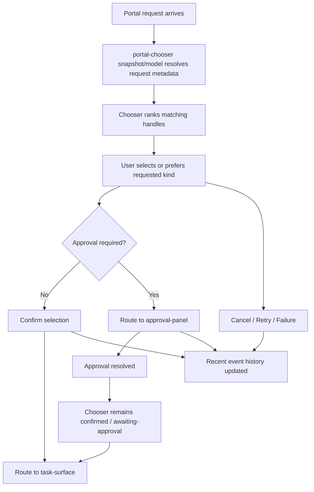

# Portal Flow

This document defines the formal Team C portal chooser interaction path.

## Covered Handle Types

- `file_handle`
- `directory_handle`
- `export_target_handle`
- `screen_share_handle`

## User Flow

## Interaction Semantics

- `prefer-requested` promotes the highest-ranked handle that matches `requested_kinds`
- `confirm-selection` routes to `task-surface` when approval is not required
- `confirm-selection` routes to `approval-panel` and sets `awaiting-approval` when approval metadata is present
- `review-approval` explicitly routes back to `approval-panel`
- `cancel-selection` and `retry-selection` remain on `portal-chooser`
- `availability=unavailable`, `resource_missing`, backend-unavailable handles, and `retry_after` must surface as user-readable failure context
- when the requested handle kind is unavailable, the chooser should disable implicit confirm until the user explicitly selects a fallback target

## Evidence Path

The formal portal flow should produce:

- chooser snapshot JSON
- chooser text export
- chooser export manifest
- fixture-backed recent event history for select / confirm / cancel / retry / review-approval / unavailable-resource failure
- shellctl chooser snapshot/export output
- approval-aware routing results

## Reference Commands

- `python3 aios/shell/components/portal-chooser/standalone.py snapshot --json`
- `python3 aios/shell/components/portal-chooser/standalone.py export --output-prefix /tmp/aios-portal-flow --json`
- `python3 aios/shell/shellctl.py --profile aios/shell/profiles/default-shell-profile.yaml chooser snapshot --json`
- `python3 scripts/test-portal-flow-smoke.py`
